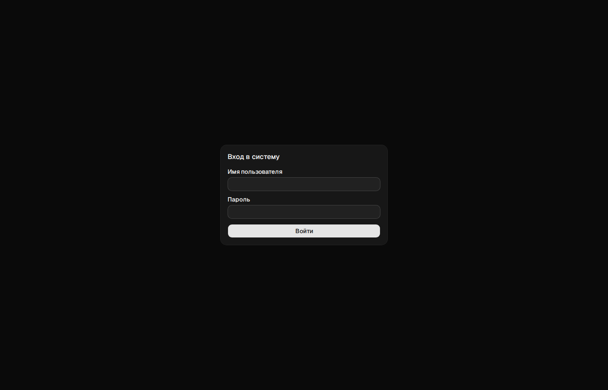
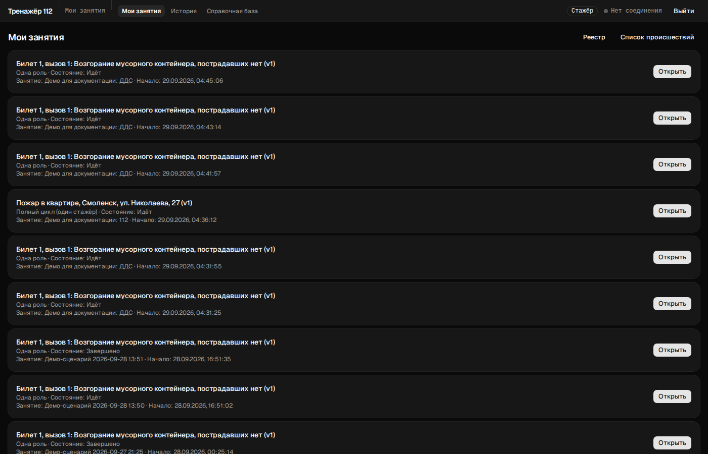
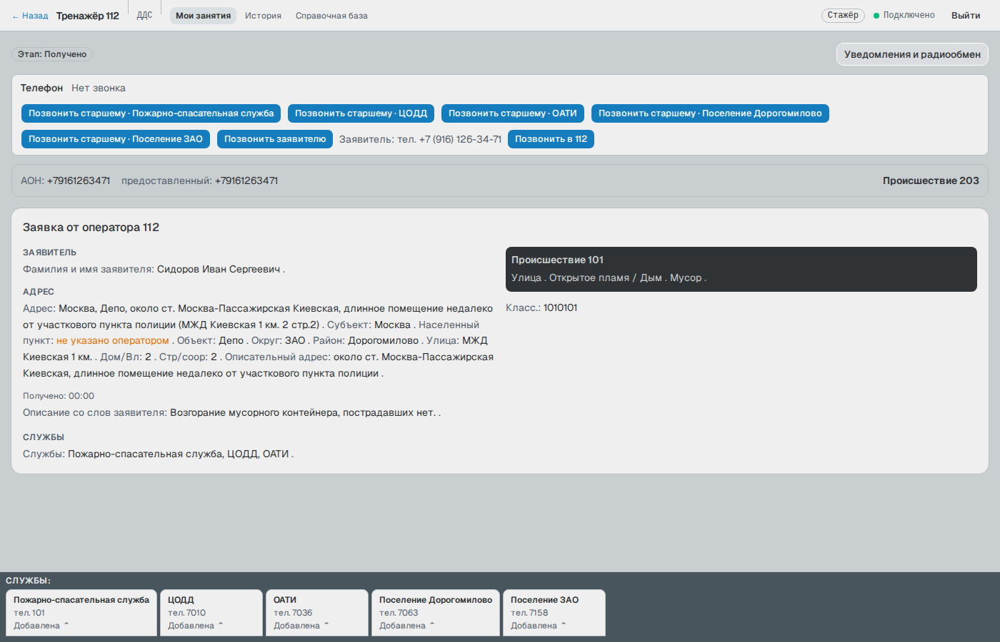
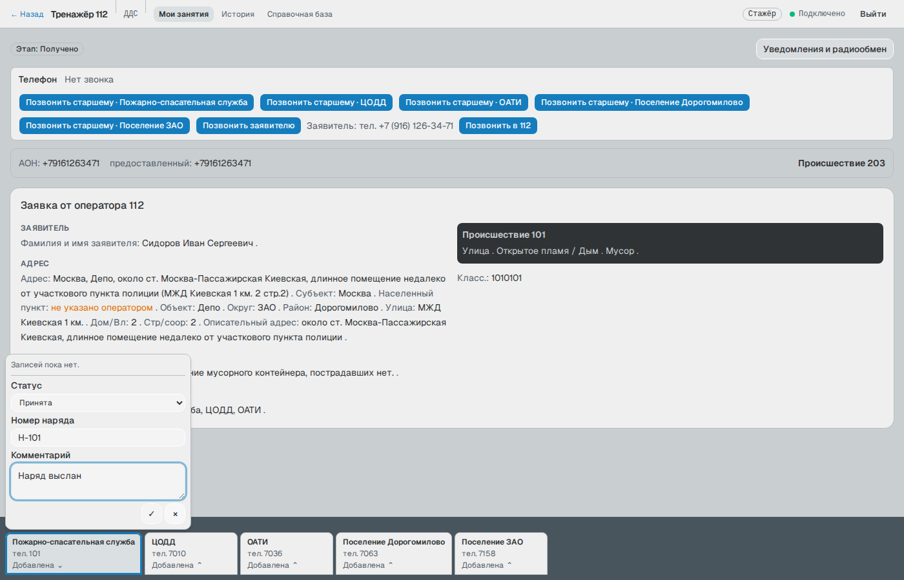
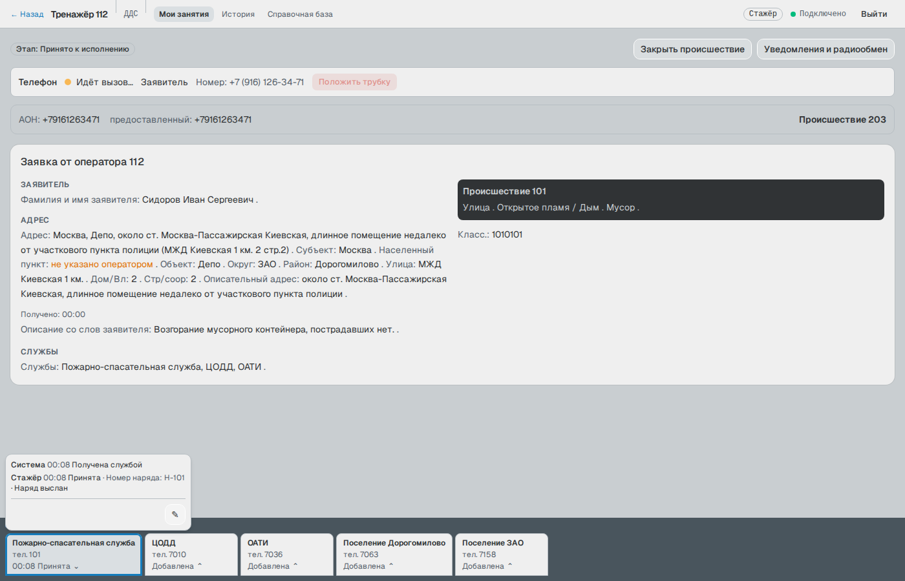
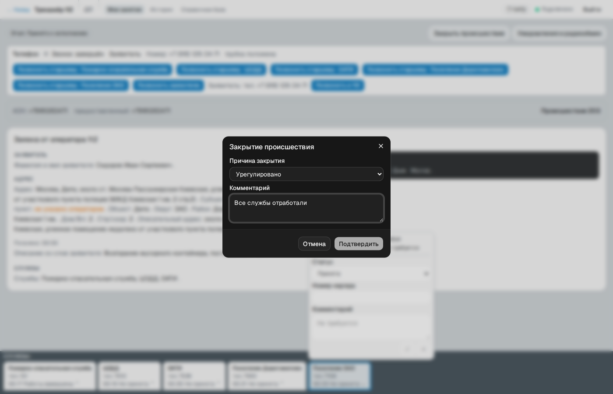
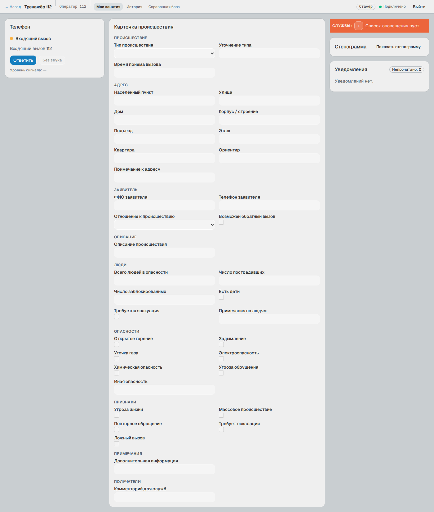
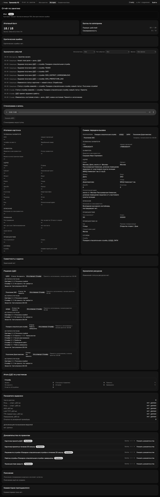
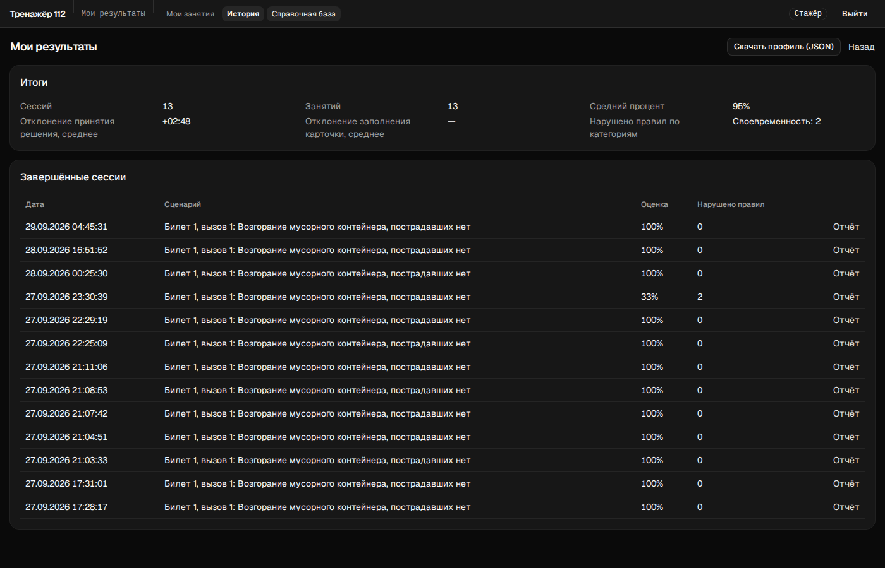
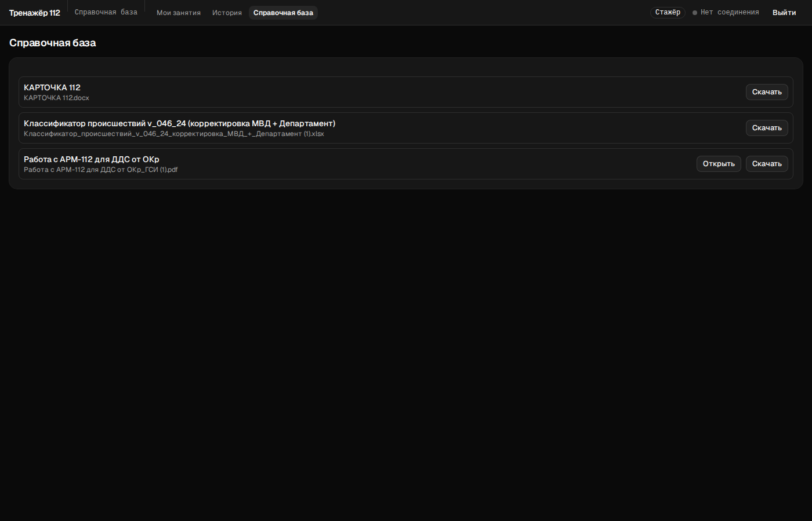

# Руководство стажёра

См. также [README.md](README.md) — оглавление раздела и общие ограничения стенда (голос требует
GPU, телефон и микрофон работают только по https).

## Вход

Откройте адрес стенда, введите логин и пароль, нажмите «Войти».

После входа стажёр попадает на страницу «Мои занятия». Вверху страницы — меню своей роли: «Мои
занятия · История · Справочная база», текущий раздел в нём подсвечен. Справа — индикатор
подключения к серверу реального времени и «Выйти».

## «Мои занятия»

Список карточек, в которых участвует стажёр — сессия по одному вызову/происшествию, а не занятие
целиком. Новая карточка всегда идёт первой (список отсортирован по времени создания). Для каждой
строки показаны: русское название сценария и версия, режим занятия, состояние («Идёт»,
«Завершено», «Прервано»…), а если карточка — часть занятия из нескольких карточек, ещё и название
занятия и время его начала (это позволяет различать несколько прогонов одного сценария). Кнопка
«Открыть» ведёт в рабочее место, соответствующее роли стажёра в этой карточке: если это роль ДДС —
на рабочее место ДДС, если оператор 112 — на рабочее место оператора 112.

Справа над списком — быстрые ссылки «Реестр» (карточки оператора 112, доступные для поиска по
номеру/адресу/классификатору) и «Список происшествий» (то же для ДДС).

Если карточка открыта до того, как преподаватель нажал «Начать занятие» (или до наступления её
времени появления в занятии из нескольких карточек), рабочее место покажет пояснение вместо
заявки: «Занятие ещё не запущено преподавателем. Когда преподаватель нажмёт «Начать занятие»,
заявка появится здесь сама.» Страница обновляется автоматически, перезагружать её не нужно.

## Рабочее место ДДС

Открывается по «Открыть» у карточки, где роль стажёра — ДДС. Как только преподаватель начинает
занятие, заявка появляется в рабочем месте сама, без перезагрузки страницы.

Сверху вниз:

- **«Этап: …»** — текущий этап работы с карточкой (Получено → Принято к исполнению → …). Кнопка
  «Закрыть происшествие» появляется в правом верхнем углу только после первого решения по хотя бы
  одной службе — до этого закрывать нечего.
- **«Уведомления и радиообмен»** — открывает боковую панель с уведомлениями по карточке.
- **«Телефон»** — состояние звонка («Нет звонка», «Идёт вызов…», «Разговор», «Звонок завершён») и
  кнопки набора: «Позвонить старшему · <служба>» для каждой оповещённой службы, «Позвонить
  заявителю», «Позвонить в 112». Кнопка набора недоступна, пока идёт другой звонок — сначала нужно
  положить трубку. Если стенд работает без голосовых моделей, звонок соединяется, но собеседник
  молчит (см. [README.md](README.md#ограничения-стенда)).
- **Заявка от оператора 112** — карточка происшествия, как её передал оператор 112: заявитель,
  адрес, описание, признаки и список служб-получателей. Поля, которые оператор не заполнил,
  показаны прочерком или пометкой «не указано оператором».
- **«СЛУЖБЫ:»** (нижняя панель) — по одной вкладке на каждую оповещённую службу, с её текущим
  статусом «по памятке ДДС» и временем от начала занятия.

### Статус службы, номер наряда, комментарий

Нажмите на вкладку службы — над ней откроется история статусов. Если служба ваша (`is_mine`),
там же будет карандаш «Изменить статус».

1. Нажмите карандаш.
2. В «Статус» выберите один из вариантов, предложенных для текущего состояния службы (список
   зависит от того, что уже происходило со службой — например, из «Получена» доступны только
   «Принята» и «Не принята»).
3. При необходимости укажите «Номер наряда».
4. Впишите «Комментарий». Он обязателен только для «Не принята» и «Отказ от выполнения работ» —
   без него форма покажет «Укажите комментарий.»; для остальных статусов поле можно оставить
   пустым.
5. Нажмите «Подтвердить» (✓) или «Отмена» (×).

Полный список статусов по памятке: «Добавлена» → «Получена службой» → «Принята» / «Не принята» →
«Начало реагирования» → «Прибытие» → «Проведение работ» → «Работы завершены» / «Отказ от
выполнения работ». История статусов (кто, когда, какой статус, номер наряда, комментарий)
сохраняется и видна в развёрнутой вкладке, а полностью — в отчёте («Решения ДДС»).

Если включён «Звонок ДДС — бригаде», статус, о котором старший службы доложил по телефону,
появляется над карандашом как подсказка-чип «Услышано по телефону» с кнопкой «Подставить в
форму» — она лишь заполняет поля, подтверждает статус всё равно стажёр.

### Звонок

«Позвонить старшему · <служба>», «Позвонить заявителю» и «Позвонить в 112» набирают номер;
«Положить трубку» завершает разговор. Если преподаватель включил вариант «SIP-телефон», тот же
звонок можно вести на зарегистрированном софтфоне вместо браузера — виджет покажет «Разговор идёт
на SIP-телефоне» (подробности — `docs/RUNBOOK.md`, раздел «SIP-телефон»).

### Закрытие происшествия

Кнопка «Закрыть происшествие» доступна, когда принято хотя бы одно решение по службе; чтобы
закрытие прошло, каждая оповещённая служба должна быть в конечном статусе («Работы завершены»,
«Отказ от выполнения работ» или «Не принята») — иначе сервер вернёт «Недопустимый переход
состояния.».

«Причина закрытия»: «Урегулировано», «Ложный вызов», «Передано другой службе», «Отменено
заявителем». «Комментарий» обязателен. «Подтвердить» закрывает карточку; в режиме «Одна роль» это
и завершает занятие — отдельно завершать его не нужно.

## Рабочее место оператора 112

Открывается, когда роль стажёра в карточке — оператор 112 (первый этап занятий, где карточку
заполняет вызов, а не собирает преподаватель заранее).

- Слева — «Телефон»: «Ответить»/«Без звука» на входящий вызов, индикатор уровня сигнала.
- В центре — «Карточка происшествия»: тип происшествия, адрес, заявитель, описание, число людей и
  пострадавших, опасности (открытое горение, задымление, утечка газа, электроопасность,
  химическая опасность, угроза обрушения), признаки (угроза жизни, массовое происшествие,
  повторное обращение, требует эскалации, ложный вызов), комментарий для служб.
- Справа — «СЛУЖБЫ:» (кого оповестить; можно добавить службу, убрать уже добавленную нельзя),
  «Стенограмма» разговора и «Уведомления».

Без голосовых моделей вызов доходит до «Входящий вызов», но дальше не продвигается — этот этап
ждёт речь заявителя (см. [README.md](README.md#ограничения-стенда)).

## Отчёт

Открывается по ссылке «Перейти к отчёту» (сразу после закрытия последней карточки — в режимах
«Аттестация» и «Несколько стажёров» только после того, как преподаватель нажмёт «Выдать отчёт
стажёрам») или из «Истории».

В отчёте: «Итог» («Сдал»/«Не сдал») с перечнем критериев; итоговый балл и баллы по категориям;
критические ошибки; хронология событий с фильтрами по исполнителю, типу события и звонку;
стенограмма и запись разговора (если голос включён — иначе «Стенограмма недоступна.»); итоговая
карточка и снимок передачи вызова; «Решения ДДС» — полная история статусов по каждой службе с
номерами нарядов; отметки о грамотности и адресах; доказательства выполнения правил оценки;
пояснение (генерируется моделью, на баллы не влияет); комментарии преподавателя.

## История

Раздел «История» в меню — «Мои результаты»: сводка (число сессий и занятий, средний процент,
своевременность) и таблица завершённых сессий с датой, сценарием, оценкой, числом нарушенных
правил и ссылкой «Отчёт». Кнопка «Скачать профиль (JSON)» экспортирует эти данные файлом.

## Справочная база

Раздел «Справочная база» — методические материалы, которые загрузил преподаватель: памятки,
классификаторы, инструкции. Для каждого файла — «Открыть» (если формат поддерживает просмотр в
браузере) и «Скачать». Список доступен стажёру только на чтение.

